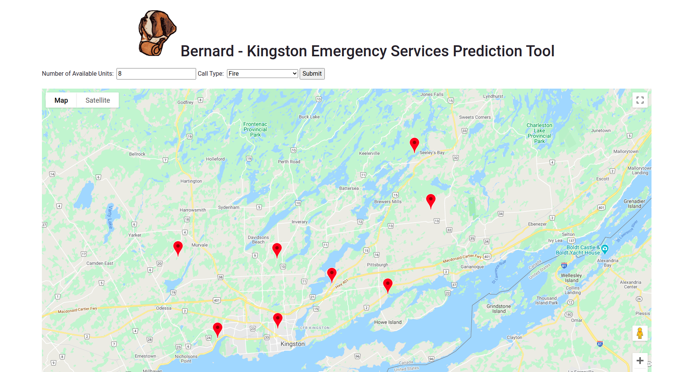

# Kingston Bernard



## Try it out
### Install dependencies
```
cd frontend/qhacks
npm i
cd backend
npm i
```
### Run backend
```
cd backend
node server.js
```
### Run frontend
```
cd frontend
npm run develop
```
Go to [http://localhost:8000/](http://localhost:8000/) to see the app in action!

## Inspiration
Emergencies are something that the city must handle on a day-today basis, and as residents of Kingston, we understand that every minute counts when responding to a call. We were thus inspired to use Kingston's Open Data resources to model an optimised distribution of emergency services across Kingston.

## What it does
Kingston Bernard - named after the famous Alpine rescue dogs - uses historical data on Fire & Rescue Incidents from 2018 to now to map out common emergency areas: whether they be fire, medical, or vehicular. Then, using a greedy metric-k center algorithm, an approximately evenly distributed positional map is generated to inform the Kingston government which locations require the most attention when providing more emergency services (such as highlighting areas that may require more police patrolling, first aid kits, etc.).

## How I built it
The web application uses a React frontend with an Express backend that computes the distribution given a number of units available to place (generates a map of a number of coordinates). It also uses Google Cloud API to display the data as a Google Map.

## What's next for Kingston Bernard
Kingston-Bernard aims to continue improving its algorithm to further optimise distribution, as well as including more data from Open Data Kingston to better implement a resourceful application.
